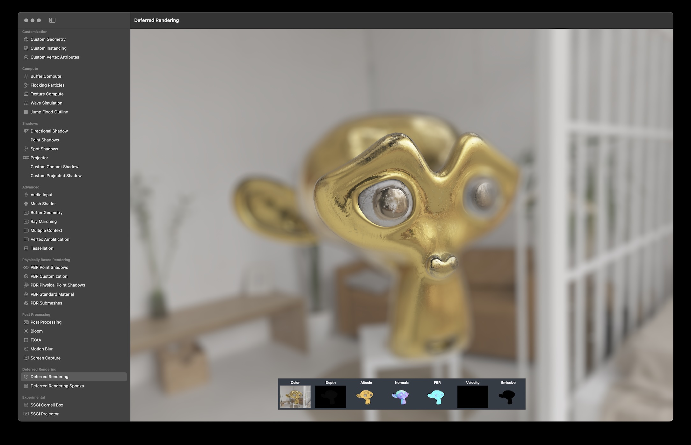
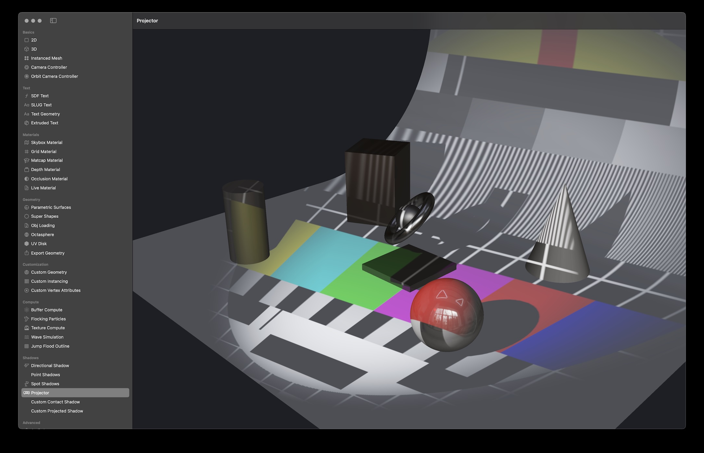
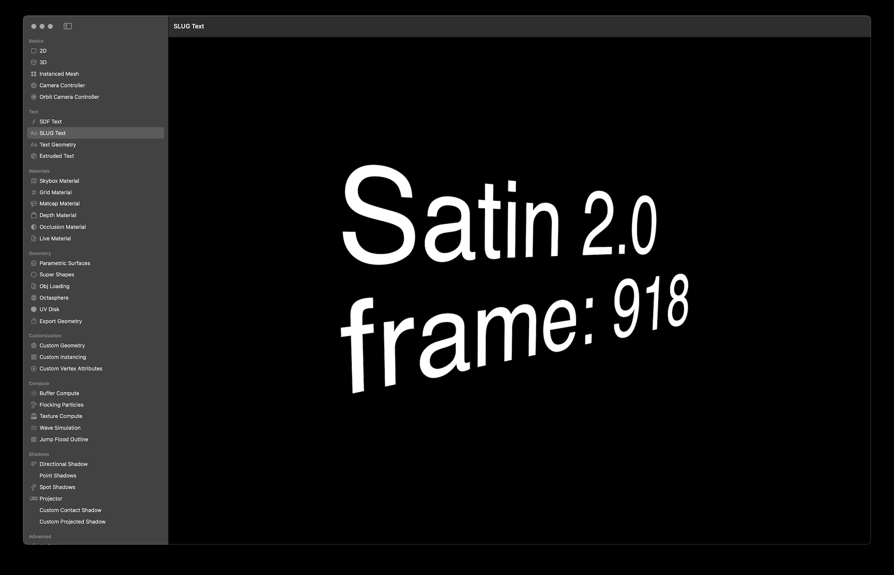

# Satin - A 3D Graphics Framework built on Apple's Metal


# About

Satin is a 3D graphics framework (inspired by threejs) that helps designers and developers work with Apple's Metal API. Satin provides helpful classes for creating meshes, materials, buffers, uniforms, geometries, pipelines (shaders), compute kernels, and more.

Satin makes simple graphics tasks fun and easy to accomplish quickly and complex graphics tasks easier to accomplish without having to write tons of boilerplate code. It does this by providing structure, opinions, and tons of helpful abstractions on Metal to help you get up and rendering / coding in a few minutes. 

Satin is mostly Swift based, however when performing expensive CPU operations, Satin uses SatinCore, which is written in C (for tasks like geometry generation, triangulation, bounds & computational geometry calculations, and more) to make sure things are as fast as possible.


# Supported Platforms

- macOS 15.0+
- iOS 18.0+
- visionOS 2.0+

# Installation

### Swift Package Manager

[Swift Package Manager](https://swift.org/package-manager/) is a tool for automating the distribution of Swift code and is integrated into the `Swift` compiler. Once you have your Swift package set up, adding `Satin` as a dependency is as easy as adding it to the `dependencies` value of your `Package.swift`.

```swift
  dependencies: [
      .package(url: "https://github.com/Fabric-Project/Satin.git", .branch("main"))
  ]
```

# Features

Satin supports modern techniques, like deferred rendering, post processing, instancing, lighting with soft shadows (and projection) model loading and more. 

<div align=“center”>

  

</div>


- [x] Tons of examples that show how to use the API (2D, 3D, Raycasting, Compute, Exporting, Live Coding, AR, etc).
- [x] Object, Mesh, InstancedMesh, TessellationMesh, Material, Shader, Geometry, Camera and Renderer classes.
- [x] Builtin Materials (BasicColor, BasicTexture, BasicDiffuse, Normal, UV Color, Skybox, MatCap and more).
- [x] PBR Support via Standard & Advanced Physical Materials (Based on Disney's PBR Implementation)
- [x] You can live code shaders.
- [x] Support for Forward, Forward + and Deferred rendering modes with support for multiple render targets.
- [x] Built in Post Processing Techniques (Motion Blur, Depth of Field and Post Processor base class)
- [x] Tons of Geometries (Box, Sphere, IcoSphere, Circle, Cone, Quad, Plane, Capsule, RoundedRect, Text, and more).
- [x] Cameras (Orthographic, Perspective) & Camera Controllers.
- [x] Slug Text Rendering
- [x] Flexible Vertex Structure
- [x] Run-time & Dynamic Struct creation via Parameters for Buffers and Uniforms.
- [x] Metal Shader Compiler (useful when live coding, using #include during runtime)
- [x] Metal Pipeline Caches (Render & Compute)
- [x] Buffer & Texture Compute Systems make running compute kernels a breeze.
- [x] Generators for BRDF LUT, Image Based Lighting (HDR -> Specular & Diffuse IBL Textures)
- [x] Fast raycasting via Bounding Volume Hierachies (very helpful to see what you clicked or tapped on).
- [x] Hooks for custom Metal rendering via Mesh's preDraw, Material's onBind, Buffer & Texture Computes' preCompute, etc
- [x] Hooks for custom rendering via the Renderable protocol
- [x] FileWatcher for checking if a resource or shader file has changed.
- [x] Platform specific examples for iOS / AR Kit integration

# Usage

Satin helps to draw things with Metal. To get up and running quickly without tons of boilerplate code and worrying about triple buffering or event (setup, update, resize, key, mouse, touch) callbacks, The example below shows how to use Satin to render a color changing box that looks at a moving point in the scene.

### Simple Example:

```swift
import Metal
import SwiftUI
import Satin

  // Subclass Satin's ViewRenderer to get triple-buffered rendering and
  // callbacks for setup, update, draw, resize, and input events
  final class SimpleRenderer: ViewRenderer {
      // A RenderEncoder handles drawing a scene either to the screen
      // or into a texture-backed render pass
      lazy var renderEncoder = RenderEncoder(context: defaultContext)

      // A PerspectiveCamera renders the scene using perspective projection
      // Cameras inherit from Object, so they have transform properties too
      lazy var camera: PerspectiveCamera = {
          let camera = PerspectiveCamera(
              context: defaultContext,
              position: [3.0, 3.0, 3.0],
              near: 0.01,
              far: 100.0,
              fov: 45.0
          )
          camera.lookAt(target: .zero)
          return camera
      }()

      // An Object is an empty node in Satin's scene graph
      // It can have children, a parent, and a transform
      lazy var scene = Object(context: defaultContext, label: "Scene", [boxMesh])

      // Meshes inherit from Object, so they also have transforms
      // A Mesh becomes renderable by pairing Geometry with a Material
      lazy var boxMesh = Mesh(
          context: defaultContext,
          label: "Box",
          geometry: BoxGeometry(context: defaultContext, size: 1.0),
          material: BasicDiffuseMaterial(context: defaultContext, hardness: 0.75)
      )

      // Track time so we can animate the scene
      var time: Float = 0.0

      // Satin calls setup once after the renderer has a valid MetalView
      override func setup() {
          renderEncoder.setClearColor(.one)
      }

      // Satin calls update once per frame before drawing
      override func update() {
          // Advance time so we can animate the box orientation and color
          time += 0.05
          let sx = sin(time)
          let sy = cos(time)

          // Setting a material property updates the material's uniforms
          boxMesh.material?.set("Color", [abs(sx), abs(sy), abs(sx + sy), 1.0])

          // Objects can update their transform directly, or use helpers like
          // lookAt to orient themselves toward a target point
          boxMesh.lookAt([sx, sy, 2.0])
      }

      // Satin calls draw when a new frame is ready to be encoded
      override func draw(renderPassDescriptor: MTLRenderPassDescriptor, commandBuffer: MTLCommandBuffer) {
          // To render a scene into a render pass, call draw and pass
          // in the render pass descriptor, command buffer, scene, and camera
          renderEncoder.draw(
              renderPassDescriptor: renderPassDescriptor,
              commandBuffer: commandBuffer,
              scene: scene,
              camera: camera
          )
      }

      // Satin calls resize whenever the drawable size changes
      override func resize(size: (width: Float, height: Float), scaleFactor: Float) {
          // Update the camera aspect ratio
          camera.aspect = size.width / size.height

          // Update the renderer's viewport and internal textures
          renderEncoder.resize(size)
      }
  }

  struct ContentView: View {
      var body: some View {
          SatinMetalView(renderer: SimpleRenderer())
      }
  }
```

# Credits

Satin was created by [Reza Ali](https://www.syedrezaali.com) with contributions & feedback from [Haris Ali](https://syedharisali.com/) and [Taylor Holliday](https://taylorholliday.com/) 

Satin is now forked and maintained by the Fabric Project, led by [Anton Marini](https://vade.info)

# License

Satin is released under the MIT license.
